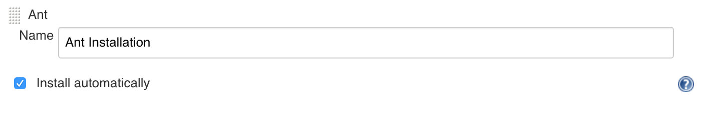
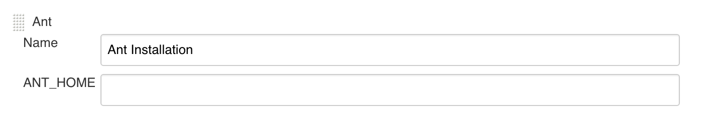
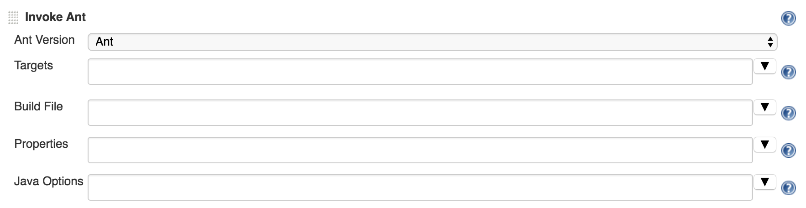

# Description

This plugin adds [Apache Ant](http://ant.apache.org/) support to Jenkins

This functionality used to be a part of the core, but as of Jenkins 1.431, it was split off into a separate plugin.

# Installation and usage

## Installation

For this plugin to be used, an Ant installation must be specified in the
global Jenkins configuration. It can be installed automatically:



Or manually:



## Usage



-   **Ant Version:** Ant Installation to use. See previous section.
-   **Targets:** Ant targets to invoke. If left blank, default target
    will be invoked.
-   **Build File:** Build file to use. If left blank, plugin will look
    for build.xml in the root directory.
-   **Properties:** Additional parameters (typical properties file
    format) to pass to the build. They are passed like -D(name)=(value)
-   **Java Options:** Custom `ANT_OPTS`.


An example of using the Ant task inside Pipeline DSL.
This code snippet must be put inside a `step` block when using the declarative syntax.

```groovy
withAnt(installation: 'myinstall') {
    dir("scoring") {
    if (isUnix()) {
      sh "ant mytarget"
    } else {
      bat "ant mytarget"
    }
}
```

# Change Log

### Version 1.10 and later

See [GitHub releases](https://github.com/jenkinsci/ant-plugin/releases).

### Version 1.9 and older

See the [old changelog](docs/old-changelog.md).
